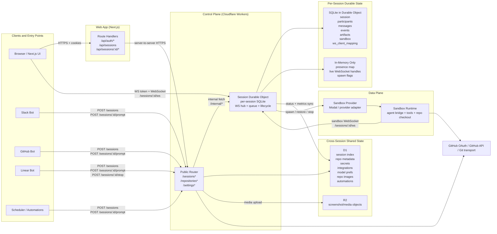
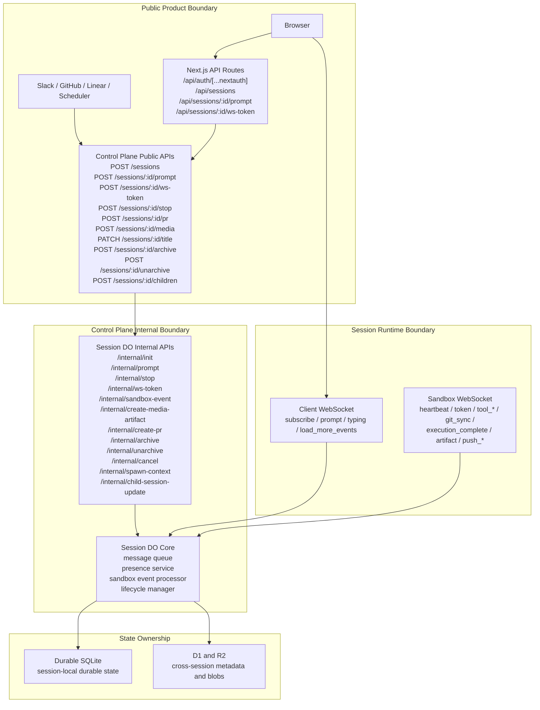
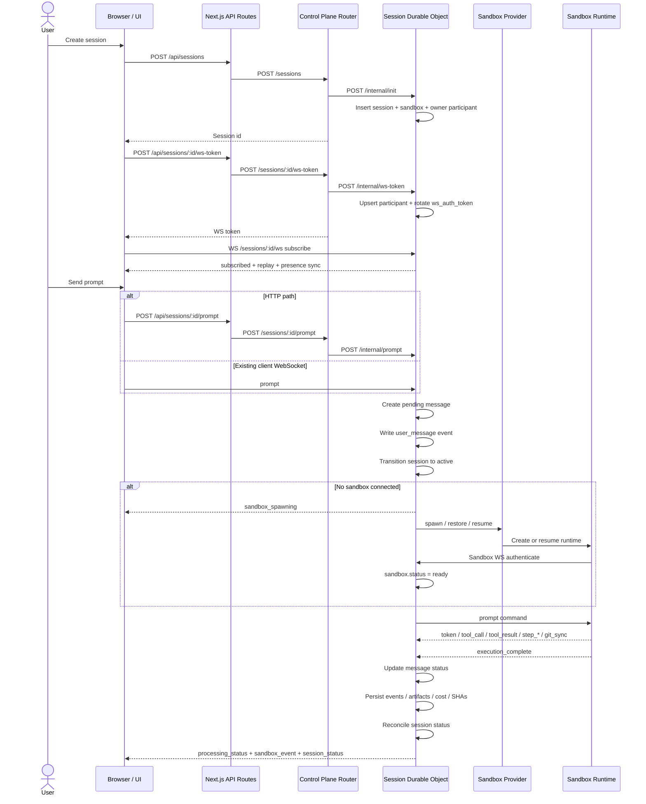
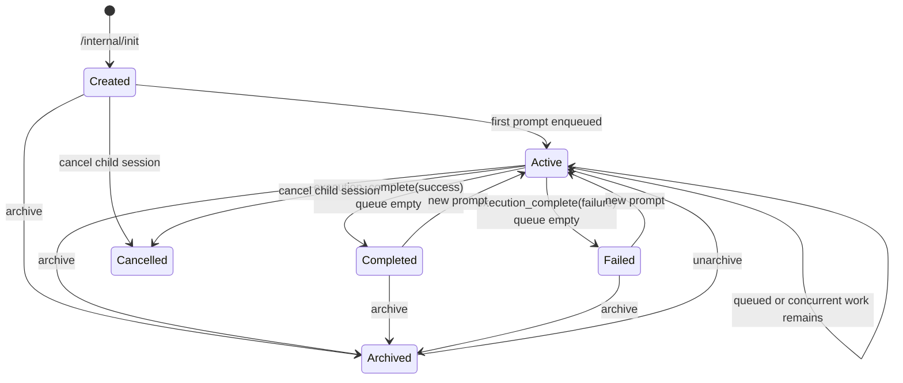
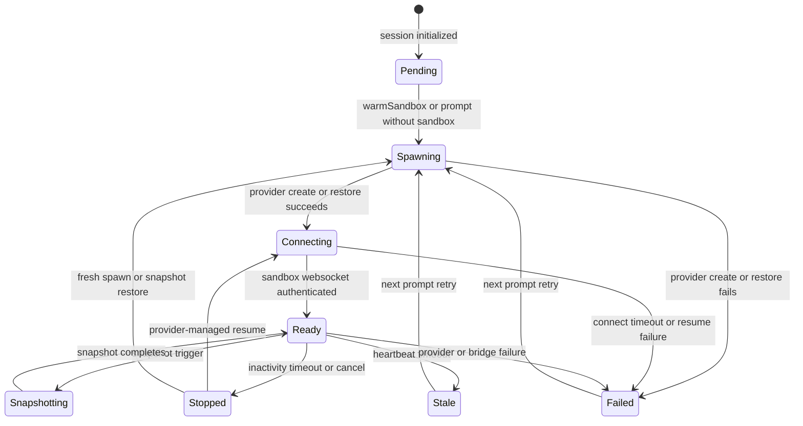
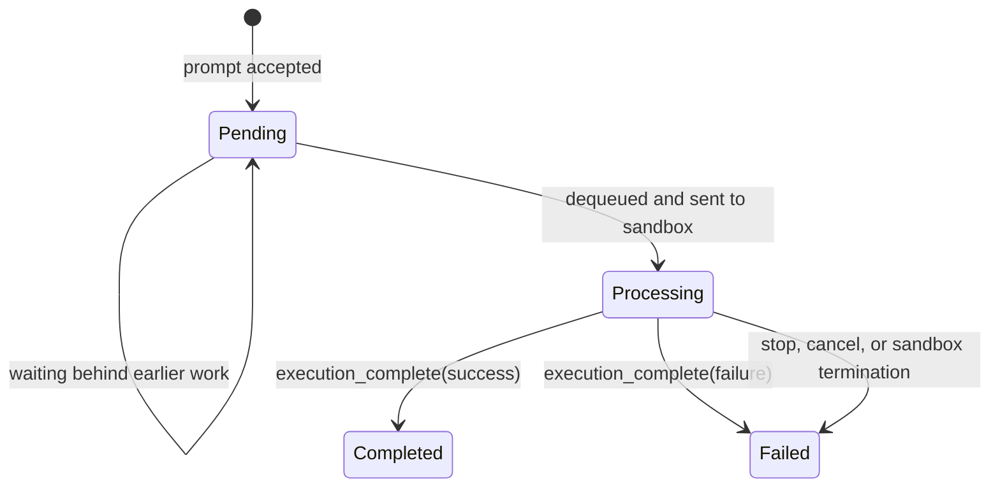

# Open-Inspect System Diagrams

This document captures the current service relationships, interface boundaries, and durable state
machines behind session execution. It follows the current implementation in `packages/web`,
`packages/control-plane`, `packages/shared`, and `packages/modal-infra`.

## Runtime Boundaries

## Interface Boundaries

## Prompt Lifecycle

## State Ownership

| State location        | Owned by           | What lives there                                                                                                           |
| --------------------- | ------------------ | -------------------------------------------------------------------------------------------------------------------------- |
| Durable Object SQLite | Session DO         | `session`, `participants`, `messages`, `events`, `artifacts`, `sandbox`, `ws_client_mapping`                               |
| Durable Object memory | Session DO process | Connected client sockets, presence, typing, current sandbox socket, in-flight spawn flags                                  |
| D1                    | Control plane      | Session index, repo metadata, encrypted secrets, integration settings, model preferences, automations, repo image metadata |
| R2                    | Control plane      | Screenshot and media object bytes                                                                                          |
| Sandbox filesystem    | Data plane         | Repo checkout, dependencies, working tree, local agent scratch state, pre-upload artifacts                                 |

## Session State Machine

Session status is user-facing progress for the whole session, not the same thing as sandbox status.

## Sandbox State Machine

The current code defines more sandbox statuses than it uses as primary durable transitions. The main
persisted lifecycle today is `pending -> spawning -> connecting -> ready`, plus the terminal paths
below.

Secondary statuses exist in shared types (`warming`, `syncing`, `running`) but are not the primary
durable state transitions used by the current control-plane lifecycle manager.

## Message State Machine

